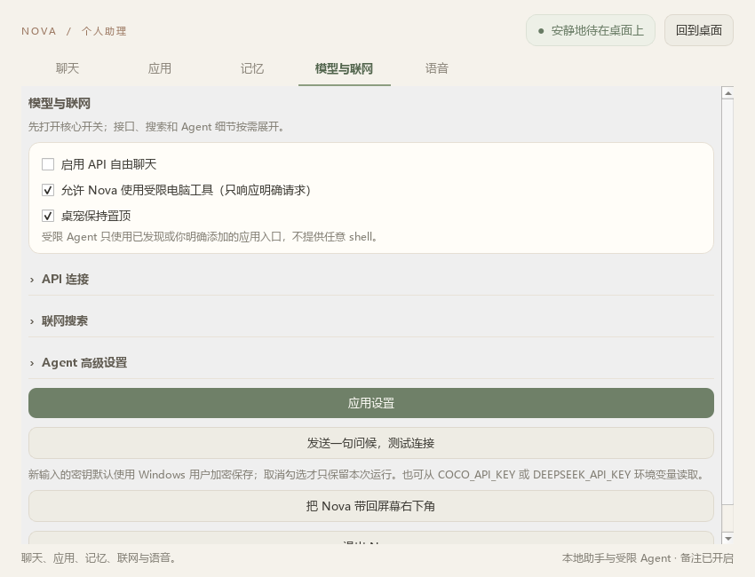

# Nova Orb Desktop Agent · v0.2.0

Nova Orb 是一个 Windows 优先、低打扰、以视觉状态反馈为核心的本地优先桌面助理。v0.2.0 是中文优先的公开预览：视觉渲染可以离线运行，聊天、部分搜索和模型规划需要用户配置服务；当前没有 MSI、签名或已发布的 Lite/Full 构建。

v0.2.0 使用暖象牙色的液态「精灵冠」作为唯一角色方向：主体由连续的非对称低双峰轮廓构成，配合烟灰色内凹胶囊眼腔、小瞳孔和克制高光。平时没有嘴和常驻光环，任务需要时才出现短暂的轨道、粒子或细小情绪线。


## 核心能力（五项主线）

- 视觉状态陪伴：透明悬浮角色、有限 gaze、点击/拖拽反馈，以及 listening、thinking、working、success、error 等可取消状态。
- 用户主动聊天与联网：OpenAI-compatible 接口和可选搜索 provider；外部结果只在本次显示，不写入后续模型历史。
- 本地语音：Whisper small 转写、有限英文唤醒短语和可选的 Windows 用户加密声纹二次校验；Nova 不朗读模型回复。
- 受限 Agent：只使用登记应用、可见窗口、受限文本编辑器、允许目录中的新文本文件和公开 URL；不提供任意 shell、PowerShell 或隐藏命令。
- 本地状态与记忆：可修订的长期备注、对话压缩和本地导出/备份；API Key 使用 Windows DPAPI 保存，不写入 SQLite。

## Agent 授权边界

电脑工具只在用户明确表达电脑、文件或网页意图时进入受限路径；设置中的 Agent 开关可以关闭工具。当前版本没有通用的逐动作确认对话框，因此直接命令就是该次操作的用户授权，结果必须由用户检查。工具白名单不包含任意 shell/PowerShell、权限提升、屏幕截图、隐藏进程或任意文件覆盖；声纹也不是身份认证。完整边界见根目录 [README](../README.md) 和 [SECURITY.md](../SECURITY.md)。

## 启动冻结包

解压发布包后双击包根目录的 `启动Nova.cmd`，设置可通过双击角色、托盘菜单或 `打开Nova设置.cmd` 打开。冻结目录中的 `NovaOrb/Coco.exe` 与 `NovaOrb/CocoSpeech.exe` 是为既有语音 worker 和数据协议保留的内部文件名，产品名称和窗口均为 Nova。

设置窗口是普通 Windows 顶层窗口，可以被其他应用覆盖。最小尺寸为 850×650；页面导航为聊天、应用、记忆、模型与联网、语音。API、搜索和 Agent 高级项默认收起，标签位于输入框上方。



## DeepSeek 配置

在“模型与联网 → API 连接”中填写兼容 OpenAI 的 API 地址、模型名称和 API Key，然后点击“应用设置”。留空 Key 会保留当前值；勾选 Windows 账户加密保存后，密钥按 endpoint 作用域存入当前用户的 DPAPI 凭据区。也支持 `COCO_API_KEY` 或 `DEEPSEEK_API_KEY` 环境变量。

普通聊天、深度分析、联网和受限 Agent 由本地规则选择路径，不额外调用分类模型。API、网络、模型或工具失败时会回到空闲状态并显示可理解的错误提示。

## 搜索配置

在“联网搜索”折叠区选择 provider。DeepSeek 原生搜索复用上方 Key；Tavily 和 Brave 使用各自的 DPAPI 作用域；DuckDuckGo 即时摘要无需 Key；SearXNG 只使用用户提供的 HTTPS endpoint。搜索不会执行网页文字，也不会把外部搜索片段写入后续聊天上下文。

## 语音与声纹

“语音”页可选择麦克风、手动开始本地识别、启用唤醒词和录入三段声纹。Whisper small 与 CAM++ 模型需要按构建说明准备在本机；录音只在内存中处理，声纹档案由当前 Windows 用户加密保存。声纹只是可选的本机唤醒二次校验，不是身份认证或高风险授权。

## 源码运行与构建

需要 Python 3.10+、Windows Qt 环境和本地语音模型：

```powershell
cd 04_桌面桌宠程序/01_程序源码
python -m pip install -r requirements.txt
python tools/render_nova_brand_assets.py
python -m coco.prepare_voice
python -m coco.launcher
```

构建 Windows onedir：

```powershell
cd 04_桌面桌宠程序/01_程序源码
python -m PyInstaller --clean --noconfirm coco_multi.spec
```

产物位于 `dist/NovaOrb/`。PyInstaller spec 会收集 QtWebEngine、本地 Nova web 资源、Whisper、CAM++ 和必要的第三方运行库；不会收集数据库、密钥、声纹、日志、测试目录、临时评审目录或个人素材。语音模型文件较大，不进入源码仓库；是否随便携式 Release 分发由对应模型许可和发布清单决定。

## 架构与协议

`coco/nova.py` 是 Qt/QWebEngine 宿主；`coco/web/nova.html`、`nova.css`、`nova_states.js` 和 `nova_renderer.js` 负责离线角色；`nova_bridge.js` 保持 `window.coco` 兼容桥。Python 行为层继续通过 `setState`、`sequence`、`react`、`gaze`、`clearGaze`、`dragRelease`、`enter` 驱动角色，并保留 `handoff_enter(source, context)` 的未来机器人交接数据入口。39 个历史状态映射到少量可组合动画参数，渲染器只用一个 `VisualPose` 和一个可暂停的 RAF 循环。

## 隐私与安全边界

- API Key、搜索 Key 和声纹档案只保存在本机用户数据区；发布包不包含任何凭据。
- 聊天、备注、SQLite、录音、声纹和日志不随源码或 Release 发布；模型大文件不随源码提交，Release 是否携带模型以对应资产和 `THIRD_PARTY_NOTICES.md` 为准。
- 角色渲染不读取照片、屏幕或数据库，不依赖 CDN 或在线头像服务。
- Agent 不执行任意 shell/PowerShell，不接受隐藏命令；工具失败不会报告为成功。
- 本项目未在没有维护者确认的情况下添加自有代码许可证；第三方组件与模型的条款见 `THIRD_PARTY_NOTICES.md`。

## 已知限制

Explorer 独立启动、真实浅色/深色桌面、多显示器边界、不同音频设备和真人唤醒/声纹准确率仍需要在目标 Windows 机器上确认。无 GPU 的 QtWebEngine 环境可能输出 GLES fallback 警告，但不应阻止角色和设置页启动。
