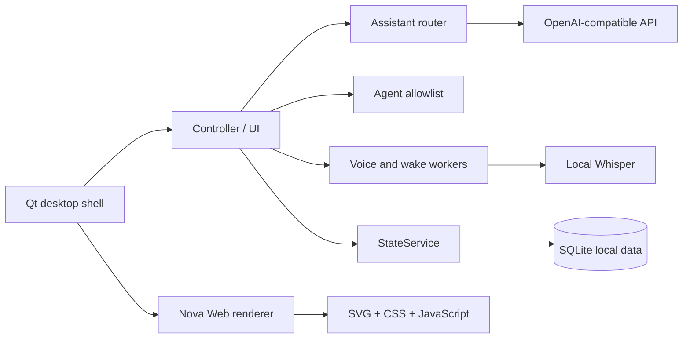

# Nova Orb

<p align="center">
  <strong>Windows-first desktop personal AI assistant with an always-present visual companion.</strong>
</p>

<p align="center">
  <a href="https://github.com/freminet-pers/nova-orb-desktop-agent/releases/latest">下载 Windows 版本</a>
  ·
  <a href="https://github.com/freminet-pers/nova-orb-desktop-agent/issues">反馈问题</a>
  ·
  <a href="#english-summary">English summary</a>
</p>

[](https://github.com/freminet-pers/nova-orb-desktop-agent/actions/workflows/ci.yml)
[](https://github.com/freminet-pers/nova-orb-desktop-agent/releases/latest)
[](#安装与使用)
[](#语言说明)


> Nova Orb 是一个 Windows 优先的桌面个人 AI 助理：它把聊天、受限电脑操作、本地语音、唤醒、个人记忆和一个常驻桌面的可视化角色放在一起。v0.2.0 是一次以“精灵冠”视觉方向为核心的公开预览更新，同时保留 v0.1.0 的行为与桥接协议。

## 项目简介

Nova Orb 的目标不是把一个聊天窗口缩小到桌面角落，而是让助理拥有一个低打扰、可观察、能表达工作状态的桌面存在感。它可以在桌面上待机、看向鼠标、回应点击和拖拽，并在聊天、搜索、语音、Agent 工具和记忆处理时显示明确的状态。

当前版本包含：

- Qt/PySide6 桌面宿主与独立设置窗口；
- OpenAI-compatible Chat Completions 接口，支持配置 DeepSeek 或其他兼容服务；
- 本地 faster-whisper 中文语音识别，不提供 TTS 播报；
- 可选的英文唤醒词监听和本机声纹二次校验；
- 受限 Agent：应用目录、可见窗口、指定文本编辑器输入、允许目录中的新文本文件和公开 HTTP(S) 网页；
- 本地 SQLite 状态、聊天记录、备注和个人记忆；
- 离线 SVG/CSS/JavaScript Nova Orb 渲染器；
- 已验证的 Windows onedir 便携包，可从 GitHub Release 下载。

### 语言说明

仓库代码中的技术标识和部分注释使用英文，但产品界面、默认提示词和主要文档目前是中文优先。项目当前没有完整的英文 UI、英文文档和本地化资源；README 保留一个简短的 English summary，方便非中文读者判断项目定位。完整国际化不属于当前版本范围。

### 关于 v0.2.0 形象

v0.2.0 锁定“精灵冠”方向：暖象牙色的非对称低双峰凝胶轮廓、烟灰胶囊眼腔、柔和散射和极少量状态光。角色仍然是低打扰的桌面陪伴，而不是高频动画吉祥物；原有 39 个状态名和 Python→QWebChannel 桥接继续兼容。

## 核心能力

| 能力 | 当前行为 |
| --- | --- |
| 桌面陪伴 | 常驻透明窗口、低频呼吸/眨眼、鼠标靠近时目光跟随、点击/拖拽/滚轮回应 |
| 聊天 | 可配置 OpenAI-compatible endpoint；请求由用户主动发送，失败和取消会回到可见状态 |
| 本地语音 | 使用 faster-whisper small 在本机完成中文转写；录音只在处理期间保留在内存中 |
| 唤醒 | 默认关闭；只接受有限的完整英文呼叫短语，例如 “hey nova”，不会用任意子串唤醒 |
| 声纹 | 可选 CAM++ 本机二次校验；不是身份认证、反重放机制或高风险操作授权 |
| Agent | 只执行白名单工具，不提供任意 shell、PowerShell、命令拼接或隐藏程序执行 |
| 记忆 | SQLite 单写者服务管理状态、聊天、备注和个人记忆；数据留在本机 |
| 状态视觉 | 将 planning、working、success、failure、cancel 等业务阶段映射为受限的视觉状态 |

## 安装与使用

### 方式一：下载 Windows Release（推荐）

1. 打开 [最新 Release](https://github.com/freminet-pers/nova-orb-desktop-agent/releases/latest)。
2. 下载 `NovaOrb-v0.2.0-Windows-x64.zip`。
3. 将 ZIP 解压到一个你有读写权限的目录。它是便携式 onedir 包，不会自动写入系统安装器或注册表。
4. 在解压后的包根目录双击 `启动Nova.cmd` 启动桌宠。
5. 双击 `打开Nova设置.cmd` 配置 API、语音、唤醒词和本地声纹。

当前便携包包含 Qt、Python 运行库和本地语音模型，解压后约 1.4 GB，Release ZIP 约 0.76 GB。第一次启动可能受到 Windows SmartScreen、杀毒软件或麦克风权限提示影响；这是未签名个人预览包的正常现象，请按自己的安全策略确认后运行。

> Release 中的包是“便携式安装包”，不是 MSI 或安装向导。关闭程序后可以直接移动或删除整个解压目录；用户数据默认保存在 %LOCALAPPDATA%/CocoDesktop，不会写回 Release 目录。

### 方式二：从源码运行

系统要求：

- Windows 10/11 x64；
- Python 3.10 或更高版本；
- 可用的 Windows 音频输入设备（只在使用语音功能时需要）；
- 若要自由聊天，需要一个 OpenAI-compatible API endpoint 和 API Key；
- 若要使用本地语音，需要额外下载模型，详见 06_语音模型/README.md。

在 PowerShell 中：

```powershell
cd 04_桌面桌宠程序/01_程序源码
python -m venv .venv
.venv\Scripts\Activate.ps1
python -m pip install --upgrade pip
python -m pip install -r requirements.txt
python -m coco
```

模型准备：

```powershell
python -m coco.prepare_voice
```

启动后打开“模型与联网”，填写 API Base URL、模型名和 API Key。API Key 默认只在内存中使用；只有主动勾选记住时才会通过 Windows DPAPI 保存到当前用户数据目录。不要把 Key 写进源码、JSON、Issue、日志或 Release 资产。

## 从源码构建 Windows 包

构建依赖：

```powershell
cd 04_桌面桌宠程序/01_程序源码
python tools/render_nova_brand_assets.py
python -m coco.prepare_voice
python -m PyInstaller --clean --noconfirm coco_multi.spec
```

输出目录为 `dist/NovaOrb/`。将它与 `05_可运行版本/启动Nova.cmd`、`05_可运行版本/打开Nova设置.cmd` 放在发布包根目录。`coco_multi.spec` 会收集 QtWebEngine、Nova 品牌资源、Whisper 和可选声纹模型；数据库、密钥、声纹档案、日志、测试缓存和个人素材不会被收集。

源代码仓库不提交 Whisper、CAM++ 或其他模型大文件。这样做既避免把第三方模型许可和大文件混进 Git 历史，也让使用者可以按自己的许可与网络条件准备模型。模型来源和完整注意事项见 THIRD_PARTY_NOTICES.md。

## 架构概览



关键模块：

| 模块 | 作用 |
| --- | --- |
| coco/nova.py | Qt WebEngine 宿主，加载离线 Nova renderer |
| coco/web/ | nova.html、nova.css、状态映射、渲染器和桥接脚本 |
| coco/ui.py | 聊天、设置、语音、Agent 和状态反馈 |
| coco/assistant.py | 明确命令、模型路由、请求边界和有限 Agent 回合 |
| coco/agent_tools.py | 应用、窗口、文本文件和公开 URL 的安全白名单 |
| coco/state.py / personal_memory.py | SQLite 单写者、状态与个人记忆 |
| coco/voice.py / wake.py | 本地录音、唤醒词、取消和 worker 生命周期 |
| coco/paths.py / secure_store.py | 资源路径、用户数据目录和 DPAPI 密钥保存 |

为兼容既有数据和语音 worker，Python 内部包名仍然是 coco，冻结包内部入口仍可能显示 Coco.exe / CocoSpeech.exe；面向用户的产品名是 Nova Orb。

## 隐私与安全边界

- 原始照片、视频、录音、数据库、聊天记录、备注、声纹档案和日志不在公开快照中。
- API Key 不进入聊天记录、导出、测试快照或打包资源；默认不持久化。
- 本地语音识别只在设备上运行；录音不作为历史记录保存。
- 联网请求只在用户使用聊天或搜索能力时发出；搜索结果不会自动写入长期记忆。
- Agent 不执行任意 shell/PowerShell，不接受由模型拼接的命令参数，也不允许向密码、凭据或数据库文件写入。
- 声纹功能只做本机唤醒后的可选二次校验，不应当用于保护金融、账号、门锁或其他高风险操作。

发现可能的安全问题时，请先阅读 SECURITY.md，不要在公开 Issue 中粘贴密钥、个人数据或完整日志。

## 测试

当前公开快照在 Windows 开发环境通过：

```powershell
cd 04_桌面桌宠程序/01_程序源码
python -m unittest discover -s tests -p "test_*.py"
python -m tests.assistant_ui_smoke
python -m tests.ui_smoke
node --check coco/web/nova_states.js
node --check coco/web/nova_renderer.js
node --check coco/web/nova_bridge.js
```

最近一次 v0.2.0 结果：125 项 unittest 通过，助理 UI smoke 通过，定向 WebEngine 探针覆盖 8 向 gaze、拖拽回弹、透明交互层和 850×650 设置页。完整 UI smoke 在最终 gaze 增益调整前命中过时的对角线阈值，按本轮“一次完整 smoke”纪律未重复运行；目标 Windows 电脑仍需确认 Explorer 独立启动、不同 DPI、多显示器边界、音频设备和显卡驱动。

## 仓库结构

```text
.
├── 04_桌面桌宠程序/
│   ├── 01_程序源码/
│   │   ├── coco/                 # Python runtime
│   │   ├── coco/web/             # Offline Nova renderer
│   │   ├── tests/                # Unit and UI smoke tests
│   │   └── coco_multi.spec       # PyInstaller onedir build
│   ├── 02_角色图片与动画/品牌图标/  # Authored SVG/PNG/ICO
│   ├── 04_配置文件/               # Sanitized public profile
│   ├── 05_可运行版本/              # Launch scripts; package is in Releases
│   └── 06_语音模型/                # Local-only model instructions
├── docs/                         # Installation, architecture, roadmap
├── .github/workflows/ci.yml      # Windows test workflow
├── THIRD_PARTY_NOTICES.md
└── README.md
```

## Roadmap

v0.3.0 的重点是把 v0.2.0 的视觉与运行时验证推进到真实 Windows 设备：

1. 继续校准不同 DPI、多显示器、桌面背景和显卡驱动下的透明窗口表现；
2. 补充更自然但仍然低频的微动作和状态过渡；
3. 完善便携包的安装说明、签名策略和模型许可记录；
4. 再评估英文 UI、本地化文档以及更正式的安装器格式。

详见 docs/ROADMAP.md。

## English summary

Nova Orb is a Windows-first desktop personal AI assistant with a small always-present visual companion. It combines an OpenAI-compatible chat endpoint, local Whisper speech recognition, optional wake-word and speaker verification, personal memory, and a deliberately constrained set of desktop tools.

The visual layer is rendered offline with Qt WebEngine, SVG, CSS, and JavaScript. Version 0.2.0 introduces the warm ivory “faerie crown” role direction while retaining the v0.1.0 bridge and state names. The Agent does not expose arbitrary shell or PowerShell execution. User data, API keys, recordings, databases, and speaker profiles are kept outside the public source snapshot.

This project is currently Chinese-first: the UI, default prompts, and main documentation are Chinese, and there is no complete English localization yet.

## 版本与发布

- 当前公开预览：v0.2.0；
- 构建身份：nova-v0.2.0-20260921；
- Release 资产：`NovaOrb-v0.2.0-Windows-x64.zip`；
- 发布形式：Windows x64 便携式 onedir ZIP，不是 MSI；
- 变更记录：CHANGELOG.md；
- 发布说明、SHA-256 和安装包：见 [GitHub Releases](https://github.com/freminet-pers/nova-orb-desktop-agent/releases/tag/v0.2.0)。

## 贡献

欢迎提交能够复现的 bug、清晰的功能建议和小范围修复。提交前请先读 CONTRIBUTING.md，不要上传个人素材、数据库、模型、密钥、运行日志或带本机绝对路径的截图。

## 许可证与第三方组件

本仓库当前没有附带通用开源许可证。公开可见不等于授予复制、再分发或商用许可；Nova Orb 的源码和原创视觉资产仍保留在维护者名下。后续若决定采用 MIT、Apache-2.0 或其他许可证，会在单独变更中明确加入。

运行库、Qt、模型和上游通知见 THIRD_PARTY_NOTICES.md。第三方组件仍受各自许可证约束。
