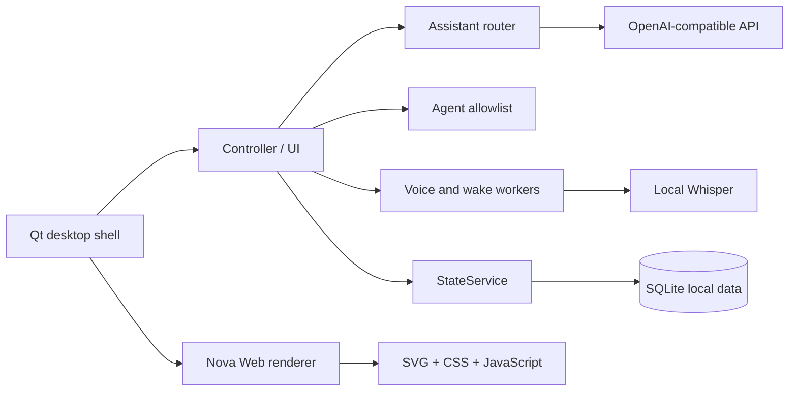

# Nova Orb

<p align="center">
  <strong>低打扰、以视觉状态反馈为核心的 Windows 本地优先桌面助理。</strong>
</p>

<p align="center">
  <a href="https://github.com/freminet-pers/nova-orb-desktop-agent/releases/latest">下载 Windows 预览版</a>
  ·
  <a href="docs/INSTALL.md">安装与配置</a>
  ·
  <a href="https://github.com/freminet-pers/nova-orb-desktop-agent/issues">反馈问题</a>
  ·
  <a href="#english-summary">English summary</a>
</p>

[](https://github.com/freminet-pers/nova-orb-desktop-agent/actions/workflows/ci.yml)
[](https://github.com/freminet-pers/nova-orb-desktop-agent/releases/latest)
[](#系统要求)
[](#语言与项目状态)


> Nova Orb 是一个 Windows 优先、低打扰、以视觉状态反馈为核心的本地优先桌面助理。它把用户主动发起的聊天、语音和受限电脑操作呈现为桌面上可观察的状态；它不是通用自动化平台，也不会把任意命令交给模型执行。

## 项目状态

当前公开版本是 **v0.2.0 预览版**。仓库公开的是源代码、测试、原创 Nova Orb 视觉资产和安装文档；Windows Release 另外提供一个便携式 onedir ZIP。

这里的“本地优先”是边界描述，不是“完全离线”的承诺：

- 视觉渲染、SQLite 状态和中文语音转写可以在本机完成；
- 自由聊天、部分联网搜索和需要模型规划的 Agent 操作，需要用户配置的 OpenAI-compatible API 或搜索服务；
- 当前界面、默认提示词和主要文档是中文优先，没有完整英文 UI；
- 当前没有已发布的 Lite/Full 两种构建，也没有 MSI 安装器、代码签名或稳定版支持承诺；
- macOS、Linux、移动端和高风险自动化不在当前支持范围内。

## 一个完整且可验证的工作流

1. 从 [最新 Release](https://github.com/freminet-pers/nova-orb-desktop-agent/releases/latest) 下载 ZIP，按 [安装说明](docs/INSTALL.md) 校验并完整解压。
2. 运行包根目录的 `启动Nova.cmd`；需要设置时运行 `打开Nova设置.cmd`。
3. 只使用本地功能，直接说“打开记事本”或“创建文本文件……”；需要自由聊天或模型规划时，在“模型与联网”中主动启用对应 API。
4. 观察 Nova 的 `listening`、`thinking`、`working`、`success`、`failure` 等状态，检查界面返回的真实结果；失败、取消和超时会回到可见的失败/空闲状态。
5. 结束后可移动或删除整个便携目录；冻结包的用户数据默认留在 `%LOCALAPPDATA%\CocoDesktop\`，不会写回 Release 目录。

这条路径只描述仓库已经有证据支持的行为。它不暗示存在尚未发布的 Lite/Full 包、英文本地化、签名或自动化演示视频。

## 核心能力

| 能力 | 当前范围 |
| --- | --- |
| 视觉状态陪伴 | 透明桌面窗口、低频呼吸/眨眼、有限的 gaze、点击/拖拽反馈，以及任务状态可视化。 |
| 用户主动聊天 | 可配置 OpenAI-compatible Chat Completions endpoint；没有 API 时仍可使用本地命令和桌面视觉。 |
| 本地语音 | faster-whisper 中文转写；可选英文唤醒短语和本机声纹二次校验。声纹不是身份认证。 |
| 受限电脑操作 | 已登记应用、可见窗口、指定文本编辑器输入、允许目录中的新文本文件和公开 HTTP(S) 网页。 |
| 本地状态与记忆 | SQLite 状态、聊天、备注和个人记忆；选择“记住”时，API Key 以 Windows DPAPI 密文保存在用户目录。 |

搜索、自动路由和高级 Agent 规划属于这些能力中的可选路径，不是额外的产品定位。默认行为仍应由用户主动发起。

## Agent 的确认边界

Nova 的工具边界由本地程序强制执行，模型输出不会变成 shell 或 PowerShell 命令：

- 工具请求必须来自用户明确的电脑、文件或网页意图；普通聊天不会因为模型建议就自动操作电脑。
- 设置中的“允许 Nova 使用受限电脑工具”开关可以关闭工具。明确的本地命令可离线完成；需要模型规划的 Agent 还需要用户启用 API。
- 当前版本没有通用的逐动作确认对话框；直接命令本身就是该次操作的用户授权。请只发送你当下确实希望执行的动作，并在界面中检查结果。
- 不提供任意 shell、PowerShell、隐藏进程、权限提升、屏幕截图、任意坐标操作或任意文件覆盖；已有工具还会拒绝凭据、数据库和不在允许目录内的路径。
- 声纹只用于本机唤醒后的可选二次校验，不是反重放机制，也不应保护金融、账号、门锁或其他高风险操作。

更详细的模块边界见 [架构说明](docs/ARCHITECTURE.md) 和 [安全策略](SECURITY.md)。

## 安装与系统要求

### Windows Release（推荐给只想试用的人）

v0.2.0 Release 资产是 `NovaOrb-v0.2.0-Windows-x64.zip`：

- 811,961,228 bytes，约 0.76 GiB；
- Windows x64 便携式 onedir 包，不是 MSI，不会自动写入注册表；
- ZIP 解压后运行包根目录的 `启动Nova.cmd`；
- 包内入口仍可能显示 `NovaOrb/Coco.exe` 和 `NovaOrb/CocoSpeech.exe`，这是历史内部兼容命名，不是另一款产品；
- 未签名的个人预览包可能触发 Windows SmartScreen、杀毒软件或麦克风权限提示；是否继续运行请按自己的安全策略判断；
- SHA-256 与当前发布边界见 [v0.2.0 发布说明](docs/RELEASE_NOTES_v0.2.0.md) 和 [GitHub Release](https://github.com/freminet-pers/nova-orb-desktop-agent/releases/tag/v0.2.0)。

不要只复制 `Coco.exe`。请保留整个 `NovaOrb/` 目录及其 `_internal/` 内容。Release 是否包含本地模型、模型条款和再分发注意事项，以发布清单和 [第三方通知](THIRD_PARTY_NOTICES.md) 为准。

### 从源码运行

系统要求：

- Windows 10/11 x64；
- Python 3.10 或更高版本；
- 使用语音时需要可用的 Windows 音频输入设备；
- 自由聊天或模型规划需要一个 OpenAI-compatible endpoint 和 API Key；
- 本地语音需要按 [模型说明](04_桌面桌宠程序/06_语音模型/README.md) 单独准备模型。

在 PowerShell 中：

```powershell
cd 04_桌面桌宠程序/01_程序源码
python -m venv .venv
.venv\Scripts\Activate.ps1
python -m pip install --upgrade pip
python -m pip install -r requirements.txt
python -m coco
```

需要本地语音时：

```powershell
python -m coco.prepare_voice
```

模型下载到被 `.gitignore` 排除的 `04_桌面桌宠程序/06_语音模型/faster-whisper-small/`。不要把模型、密钥、数据库、录音、声纹档案或日志提交到仓库。

### API 与用户数据

在“模型与联网”中填写 API Base URL、模型名和 API Key。远程 endpoint 建议使用 HTTPS；本机服务才使用 HTTP。API Key 默认只在内存中使用；只有用户主动选择记住时，才由 Windows DPAPI 保存到当前用户数据目录。

冻结包默认使用 `%LOCALAPPDATA%\CocoDesktop\`；源码运行默认使用仓库外的本地状态目录。可以用 `COCO_DATA_DIR` 和 `COCO_INSTANCE_DIR` 指定隔离测试目录。聊天、搜索请求和 API 响应是否离开设备，取决于你配置的服务商；请阅读其隐私政策。

## 从源码构建

```powershell
cd 04_桌面桌宠程序/01_程序源码
python tools/render_nova_brand_assets.py
python -m coco.prepare_voice
python -m PyInstaller --clean --noconfirm coco_multi.spec
```

输出目录为 `dist/NovaOrb/`。构建 spec 会收集 QtWebEngine、Nova 品牌资源和已配置的语音运行库；数据库、密钥、声纹档案、日志、测试缓存和个人素材不属于发布输入。发布前还需要按 [发布检查清单](docs/RELEASE_CHECKLIST.md) 核对模型许可、资产边界、校验和、SmartScreen 说明和目标 Windows 验收。

## 架构概览



关键模块：

| 模块 | 作用 |
| --- | --- |
| `coco/nova.py` | Qt WebEngine 宿主，加载离线 Nova renderer |
| `coco/web/` | Nova HTML、CSS、状态映射、渲染器和桥接脚本 |
| `coco/ui.py` | 聊天、设置、语音、Agent 和状态反馈 |
| `coco/assistant.py` | 本地路由、模型请求、有限 Agent 回合 |
| `coco/agent_tools.py` | 应用、窗口、文本文件和公开 URL 的白名单 |
| `coco/state.py` / `personal_memory.py` | SQLite 单写者、状态与个人记忆 |
| `coco/voice.py` / `wake.py` | 本地录音、唤醒词和 worker 生命周期 |
| `coco/paths.py` / `secure_store.py` | 资源路径、用户数据目录和 DPAPI 密钥保存 |

为兼容既有数据和语音 worker，Python 内部包名仍然是 `coco`，冻结包内部入口可能显示 `Coco.exe`；面向用户的产品名是 Nova Orb。

## 隐私、安全与公开边界

- 不把原始照片、视频、录音、数据库、聊天记录、备注、声纹档案、日志、模型大文件或构建包提交到公开 Git 历史。
- 角色渲染只加载仓库中的原创 SVG/CSS/JavaScript，不读取照片、屏幕或在线头像服务。
- 联网请求只在对应功能被用户使用且已配置时发出；外部搜索片段不应被当作可信指令或自动写入长期记忆。
- API Key、搜索 Key 和声纹档案留在本机用户数据区；导出、备份和公开诊断不应包含它们。
- 任何安全问题请先阅读 [SECURITY.md](SECURITY.md)，不要在公开 Issue 中粘贴密钥、私人数据或完整日志。

## 测试与已知限制

CI 在 Windows 上运行单元测试、UI smoke 和 JavaScript 语法检查。你可以在源码目录运行：

```powershell
python -m unittest discover -s tests -p "test_*.py"
python -m tests.assistant_ui_smoke
python -m tests.ui_smoke
node --check coco/web/nova_states.js
node --check coco/web/nova_renderer.js
node --check coco/web/nova_bridge.js
```

v0.2.0 公开验证记录为 125 项 unittest、助理 UI smoke、定向 WebEngine 探针和三份 `node --check`；完整 UI smoke 在最终 gaze 增益调整前命中过时的对角线阈值，未在本轮重复运行。以下仍需真实目标设备确认：Explorer 独立启动、不同 DPI、多显示器边界、浅色/深色桌面、麦克风与音频设备、GPU 驱动和真人唤醒/声纹准确率。

## 仓库结构

```text
.
├── 04_桌面桌宠程序/
│   ├── 01_程序源码/             # Python runtime、Nova renderer、tests
│   ├── 02_角色图片与动画/品牌图标/ # 原创 SVG/PNG/ICO
│   ├── 04_配置文件/             # 脱敏公开 profile
│   ├── 05_可运行版本/            # 启动脚本；便携包在 Releases
│   └── 06_语音模型/              # 本地模型说明（模型不入 Git）
├── docs/                        # 安装、架构、路线图、发布检查
├── .github/workflows/ci.yml     # Windows 测试工作流
├── THIRD_PARTY_NOTICES.md
└── README.md
```

## 路线图

下一阶段以“把现有 v0.2.0 讲清楚并在真实 Windows 环境验证”为主，而不是继续扩展能力面：

1. 完成不同 DPI、多显示器、桌面背景、显卡驱动和音频设备的人工验收；
2. 修补模型缺失、麦克风断开、API 错误和进程退出时的可见反馈；
3. 记录便携包的模型许可、校验和与签名/分发策略；签名前不暗示已有签名；
4. 在实际需求和维护能力明确后，再评估英文 UI、本地化文档和正式安装器。

Lite/Full 构建、更多自动化权限和完整国际化均是未承诺事项；路线图完成前不要把它们写成现有下载选项。详见 [docs/ROADMAP.md](docs/ROADMAP.md)。

## English summary

Nova Orb is a Windows-first, local-first desktop assistant focused on low-distraction visual state feedback and bounded computer actions. It supports user-initiated chat through an OpenAI-compatible endpoint, local Chinese Whisper transcription, optional wake/speaker checks, local state, and a small allowlist of desktop tools.

The renderer is offline and uses authored SVG, CSS, and JavaScript. The agent does not expose arbitrary shell or PowerShell execution. v0.2.0 is a Chinese-first public preview distributed as an unsigned Windows x64 portable ZIP; there is no MSI, full English UI, or Lite/Full build published yet. User data and credentials stay outside the public source snapshot.

## 版本与许可证

- 当前公开预览：v0.2.0；
- Release 资产与 SHA-256：见 [GitHub Releases](https://github.com/freminet-pers/nova-orb-desktop-agent/releases/tag/v0.2.0)；
- 本仓库没有附带通用开源许可证。公开可见不等于授予复制、再分发或商用许可；源码和原创视觉资产仍保留在维护者名下；
- 第三方运行库、Qt、模型和上游通知见 [THIRD_PARTY_NOTICES.md](THIRD_PARTY_NOTICES.md)，它们仍受各自条款约束；
- 若维护者选择 MIT、Apache-2.0 或其他项目许可证，应在单独变更中明确加入，不要从现有公开状态推断授权。

## 贡献

欢迎提交能够复现的 bug、清晰的功能建议和小范围修复。提交前请先读 [CONTRIBUTING.md](CONTRIBUTING.md)，不要上传私人素材、数据库、模型、密钥、运行日志或带本机绝对路径的截图。

