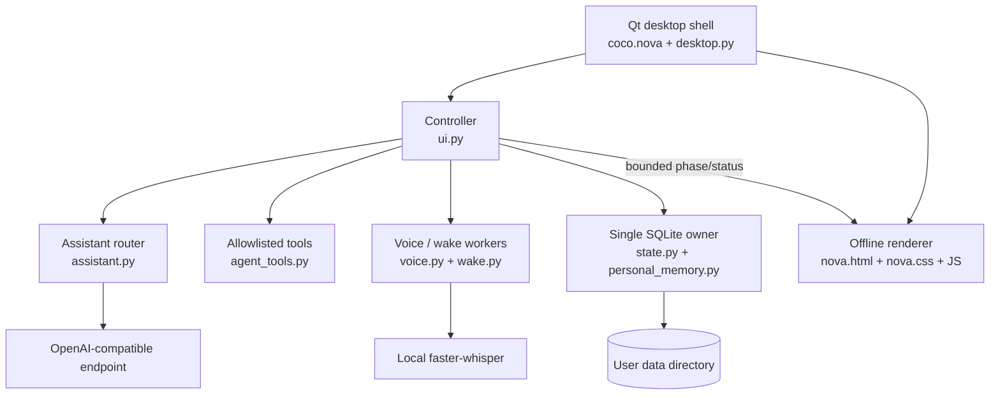

# Architecture

Nova Orb is intentionally split into a native desktop shell, a local state owner, bounded assistant routing, and an offline visual renderer.

## Boundaries

### Native shell

coco/nova.py hosts the WebEngine view and exposes only the bridge events needed by the renderer. desktop.py owns the transparent hit surface, drag motion, gaze sampling and the normal desktop window.

### Assistant and Agent

assistant.py handles deterministic commands and OpenAI-compatible chat requests. agent_tools.py provides a finite tool catalog. Model output is parsed as a choice from that catalog; arbitrary commands, shell fragments and hidden program launches are not valid tools.

### State owner

StateService is the only SQLite owner. Memory tables share that connection, avoiding multiple worker-owned connections and keeping commit/rollback boundaries visible.

### Audio workers

Microphone capture is bounded by timers and buffers. Whisper recognition runs in an independent worker process. Wake-word recognition only accepts complete phrases from a small English allowlist; an optional speaker profile is checked locally after a phrase match.

### Visual layer

The renderer is local and deterministic. Python emits constrained state and event names; JavaScript owns interpolation, gaze, scene beats and bounded animation frames. The public visual assets are the authored Nova Orb SVG, PNG and ICO.
